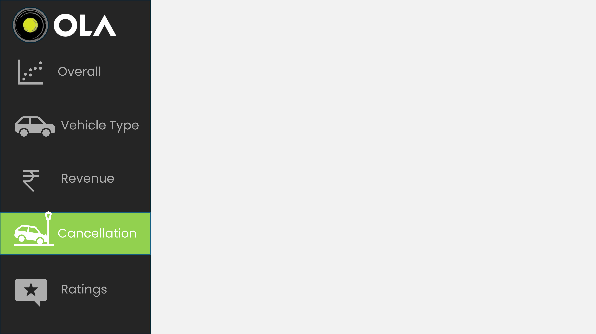

# OLA-Dashboard

A Power BI based dashboard built for visualising and analysing ride-booking data from OLA Cabs.  
This dashboard enables business users and analysts to monitor key metrics such as total rides, cancellations, sources of cancellation, ride trends over time, and more.



---

## 🚀 Key Features

- Interactive visuals in **Power BI** for exploring ride-level data and trends.  
- Metrics such as total bookings, cancelled bookings, and cancellation percentage.  
- Ability to filter by dates, ride status, ride type, and other dimensions.  
- Drill-down capabilities to explore cancellations by customer vs driver.  
- Clean, readable visuals suitable for business stakeholders.

## 🛠 Setup & Installation

1. Clone or download this repository  
   ```bash
   git clone https://github.com/kunshbhatia/OLA-Dashboard.git
